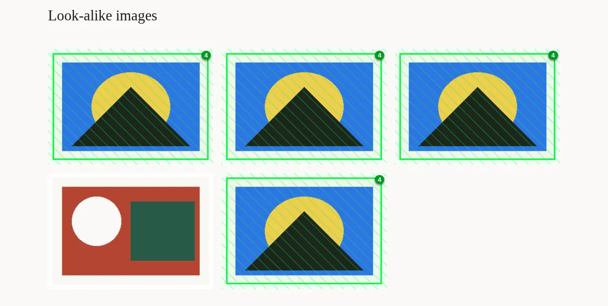

# Duplicate Image Highlighter

A Chrome extension that marks images on a web page that look like other images on the same page. After you click its toolbar button, each look-alike gets a striped overlay and a pill showing how many different image files look the same: blue for 2, shading to red for 10 or more.

It compares what images look like, not their URLs: two different files of the same picture (resized, re-encoded) are duplicates.



Four copies of the same picture get a stripe and a count of 4. A different picture stays unmarked.

What it is not:

- **Not automatic.** Nothing runs on a page until you click the toolbar button, and only in that tab's top frame.
- **Not on the Chrome Web Store.** You load it yourself (below).
- **Not a URL checker.** The same image URL shown twice is not a duplicate.

The header comment of [`extension/content.js`](extension/content.js) is the behavior spec: match threshold, size limits, colors, and the keyboard shortcuts.

## Install

1. Download `duplicate-image-highlighter-<version>.zip` from the [latest release](../../releases/latest) and unzip it, or clone this repository.
2. Open `chrome://extensions` and turn on **Developer mode** (top right).
3. Click **Load unpacked** and choose the unzipped `duplicate-image-highlighter-<version>` folder, or the repository's `extension` folder.

Chrome will say the extension can "read and change your data on all websites". That is what lets it download images from other domains to compare their pixels. It sends no cookies with those downloads.

## Development

```bash
node --test tests/*.test.js
```

After editing files under `extension/`, click the reload icon on the extension's card in `chrome://extensions`.

### Packaging

1. Set the version in `extension/manifest.json`, add a dated `## <version> (YYYY-MM-DD)` section to `CHANGELOG.md`, and commit.
2. Run `scripts/package.sh <version>`. It builds `duplicate-image-highlighter-<version>.zip` and `release-notes.md` (that CHANGELOG section) locally under `dist/`, from the committed `HEAD` only, and refuses a version or CHANGELOG mismatch.

## License

[MIT](LICENSE) — Copyright (c) 2026 Erik Sjaastad
