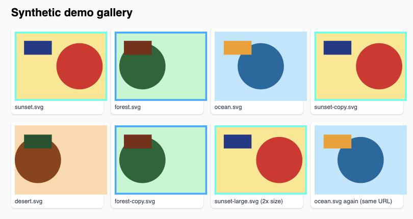

# Duplicate Image Highlighter

A Chrome extension that finds images on a web page that look the same and marks them, so you can spot repeats in a gallery, a product grid or a search results page at a glance.

It compares what the images **look like**, not their URLs: two different files of the same picture (resized, re-encoded, lightly recompressed) count as duplicates.

- **Click to run.** Nothing happens on a page until you click the toolbar button.
- **Per tab, in memory.** Nothing is stored or sent anywhere; reload the page and it is gone.
- **Works on any site** with ordinary `` elements.

## What you see



Above: three files of the same sunset (one at twice the size) and two of the same forest are outlined. The same ocean URL shown twice and the unique desert are not.

Each duplicate gets a colored outline drawn just inside its edge. The color shows how many different image files on the page look like it: blue for 2, shading to red for 10 or more. The outline takes no space, so the page layout does not move. Press Alt + Shift + D for the exact counts in the browser console.

The toolbar badge shows `…` while images are being compared, then the number of duplicate groups found (`0` in green if there are none).

## Install

There is no Chrome Web Store listing; you load the extension from this repository.

1. Download the code: click **Code → Download ZIP** on GitHub and unzip it, or `git clone` the repository.
2. Open `chrome://extensions` in Chrome.
3. Turn on **Developer mode** (top right).
4. Click **Load unpacked** and choose the `extension` folder inside the download.
5. Optional: click the puzzle-piece icon in the toolbar and pin **Duplicate Image Highlighter**.

Chrome will say the extension can "read and change your data on all websites". That permission is what lets it download images from other domains to compare their pixels (see [Permissions](#permissions)); it never runs on a page you have not clicked it on.

## Use

1. Open a page with images.
2. Click the toolbar button.
3. Scroll: images are compared as they come near the screen, including ones added by infinite scroll.

Click the button again to rescan; this also retries images that failed to load. Reload the page to clear everything. Keyboard shortcuts while it is active:

| Shortcut | Action |
| --- | --- |
| Alt + Shift + S | Rescan the page |
| Alt + Shift + D | Print duplicate groups to the browser console |

## How it works

Each image is shrunk to 32×32 pixels and turned into a 992-bit *difference hash* (dHash): one bit per pair of neighboring pixels, set when the left one is brighter. Two images whose hashes differ in 5 bits or fewer are treated as the same picture. This survives resizing, re-encoding and small color shifts, and ignores images under 100×50 pixels (icons, spacers) and solid-color placeholders.

The same image URL used twice on a page is **not** flagged; the extension looks for different files that show the same picture.

## Limitations

- Only the top-level page is scanned. Images inside iframes are not compared.
- Images drawn as CSS backgrounds or on `<canvas>` are not seen, only `` elements.
- Browser-internal pages (`chrome://…`, the Chrome Web Store, built-in PDF viewer) cannot be scanned; the badge shows `×`.
- Images are fetched without your cookies, so images that need you to be logged in, or that refuse requests from other sites (hotlink protection), are skipped.
- Images larger than 20 MB, or that take longer than 15 seconds to download, are skipped.
- A page script that rewrites an image's `style` attribute removes its outline until the next rescan.
- The outline sits just inside the image's edge, so when a page crops an image inside a smaller box, or draws captions or arrows over it, part or all of the outline can be hidden. The toolbar count and Alt + Shift + D still list the group.
- The match threshold (5 bits) is fixed in `extension/content.js` (`HAMMING_THRESHOLD`).

## Permissions

| Permission | Why |
| --- | --- |
| `scripting` | Inject the scanner into the tab when you click the button. |
| Host access to `http://*/*` and `https://*/*` | Fetch images from other domains so their pixels can be read. Without it the browser blocks reading cross-origin image pixels. Requests are sent without cookies. |

## Development

```bash
node --test tests/*.test.js     # unit tests (hashing, service worker)
```

After editing files under `extension/`, click the reload icon on the extension's card in `chrome://extensions`.

## License

[MIT](LICENSE)
